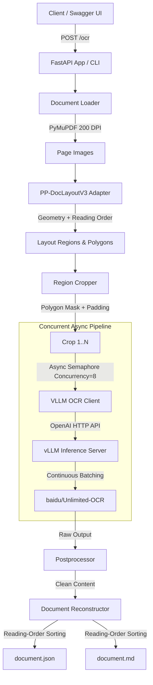

# Two-Stage Hybrid Layout-Preserving OCR Engine

High-performance, two-stage layout-aware OCR engine that processes PDF documents and multi-format images (PNG/JPG), extracts layout structure and reading order via **PP-DocLayoutV3**, crops regions with polygon masking, executes async concurrent OCR calls to **baidu/Unlimited-OCR** served by **vLLM**, postprocesses outputs, and reconstructs canonical structured JSON and layout-preserving Markdown.

---

## 1. Architecture Overview



---

## 2. Why Two-Stage?

* **Stage 1 (Layout Detection)**: Answers *"What is where?"* by identifying title, text, table, figure, equation, chart, and list region geometry along with reading order using PP-DocLayoutV3.
* **Stage 2 (VLM Transcription)**: Answers *"What does this region say?"* by sending cropped image regions in parallel to the specialized document VLM (`baidu/Unlimited-OCR`) served by vLLM with continuous batching.

This hybrid approach prevents full-page hallucination, preserves multi-column reading order, maintains complex table structures, and maximizes GPU utilization.

---

## 3. Technology Stack

* **Language**: Python 3.11+
* **API / Server**: FastAPI + Uvicorn
* **PDF Rendering**: PyMuPDF (`fitz`) @ 200 DPI (configurable)
* **Image Processing**: Pillow + OpenCV
* **Layout Detection**: PP-DocLayoutV3 (PaddleX / PaddleOCR adapter)
* **OCR / VLM Serving**: vLLM serving `baidu/Unlimited-OCR`
* **VLM Communication**: Async OpenAI API (`httpx`) with `<image>document parsing.` prompt
* **Config & Schemas**: Pydantic v2 + Pydantic Settings
* **Testing**: pytest + pytest-asyncio

---

## 4. Quick Start & Installation

### Step 1: Clone & Setup Virtual Environment
```bash
python3 -m venv venv
source venv/bin/activate
pip install -r requirements.txt
```

### Step 2: Environment Configuration
Copy `.env.example` to `.env`:
```bash
cp .env.example .env
```

To run offline pipeline tests without an active vLLM GPU server, set in `.env`:
```env
OCR_MOCK_MODE=true
```

### Optional: OCR.Space provider

The existing `/ocr` and `/finance/process` endpoints can use OCR.Space instead of the local layout/VLM pipeline. OCR.Space results are converted into the same `DocumentResult` shape, so classification, finance extraction, persistence, graph sync, and vector indexing continue to run. Oversized images and PDFs are recompressed when possible. CSV, TXT, XLSX, and DOCX files are parsed locally and sent directly to classification and finance extraction without an OCR.Space request; images and PDFs continue through OCR.Space.

Set these values in `.env` (keep the API key out of Git):
```env
OCR_PROVIDER=ocr_space
OCR_SPACE_API_KEY=your_ocr_space_api_key
```

The integration rejects files larger than 1,000,000 bytes and PDFs with more than 3 pages before making the API request. The free OCR.Space plan may also enforce its own daily or rate limits.

### Optional: LangChain intelligence narration

Finance Copilot and Investigations remain deterministic and evidence-backed. LangChain is an optional narration layer: it receives validated plans, tool results, report calculations, and evidence, then rewrites only user-facing prose. It cannot execute arbitrary SQL, change financial values, create graph relationships, or replace rules and anomaly calculations. If it is disabled, unavailable, or fails, the deterministic response is returned.

Enable it in `.env` with an OpenAI-compatible model endpoint:
```env
LANGCHAIN_ENABLED=true
LANGCHAIN_MODEL_PROVIDER=openai_compatible
LANGCHAIN_API_KEY=your_model_api_key
LANGCHAIN_BASE_URL=https://api.openai.com/v1
LANGCHAIN_MODEL=gpt-4o-mini
LANGCHAIN_TEMPERATURE=0
LANGCHAIN_REQUIRE_EVIDENCE=true
```

For a local model, set `LANGCHAIN_BASE_URL` to that model server's `/v1` endpoint. Do not point it at the LedgerLens FastAPI URL unless a separate model service is serving there.

### Grok 4.6

For backend Copilot and Investigation narration, configure xAI's OpenAI-compatible API:
```env
LANGCHAIN_ENABLED=true
LANGCHAIN_MODEL_PROVIDER=xai
XAI_API_KEY=your_xai_api_key
LANGCHAIN_BASE_URL=https://api.x.ai/v1
LANGCHAIN_MODEL=grok-4.6
```

The Puter `puter.ai.chat()` example is browser-side JavaScript and is not used for backend finance answers. Calling it from the browser would bypass the server's tenant isolation and evidence validation. The xAI provider keeps Grok behind the existing grounded backend flow.

### Gemini

To use Google Gemini instead of Grok, configure:
```env
LANGCHAIN_ENABLED=true
LANGCHAIN_MODEL_PROVIDER=gemini
GEMINI_API_KEY=your_gemini_api_key
LANGCHAIN_MODEL=gemini-2.5-flash
LANGCHAIN_TEMPERATURE=0
LANGCHAIN_REQUIRE_EVIDENCE=true
```

Gemini only narrates verified Copilot and Investigation results. It does not replace the deterministic finance tools or calculations.

---

## 5. Running the vLLM Inference Server

vLLM requires a CUDA-compatible NVIDIA GPU (Linux environment).

```text
Laptop / Orchestrator Machine
        │
        │ HTTP (VLLM_BASE_URL)
        ▼
Linux NVIDIA GPU Server
        │
        ▼
vLLM + baidu/Unlimited-OCR
```

Launch command for vLLM:
```bash
python3 -m vllm.entrypoints.openai.api_server \
    --model baidu/Unlimited-OCR \
    --trust-remote-code \
    --port 8000 \
    --max-model-len 4096
```

---

## 6. Verification & Smoke Testing

### 1. Environment Health Check
```bash
python scripts/check_environment.py
```

### 2. Stage 1 Layout Detection Smoke Test
```bash
python scripts/test_layout.py samples/test.png
```

### 3. Stage 2 vLLM Inference Smoke Test
```bash
python scripts/test_vllm.py samples/test.png
```

### 4. End-to-End Pipeline Execution (CLI)
```bash
python scripts/run_sample.py samples/report.pdf
```

---

## 7. Running the FastAPI Server

Start the ASGI server:
```bash
uvicorn app.main:app --host 0.0.0.0 --port 8000 --reload
```

Interactive API documentation available at:
`http://localhost:8000/docs`

### Example API Request (curl)
```bash
curl -X POST "http://localhost:8000/ocr?save_debug=true" \
  -H "accept: application/json" \
  -H "Content-Type: multipart/form-data" \
  -F "file=@samples/report.pdf"
```

---

## 8. Output Artifacts Structure

For each processed document, artifacts are organized in `./outputs/<document-id>/`:

```text
outputs/<document-id>/
│
├── document.json               # Canonical structured JSON schema
├── document.md                 # Layout-preserving reconstructed Markdown
│
├── pages/                      # Original rendered page images
│   ├── page_001.png
│   └── page_002.png
│
├── overlays/                   # Color-coded region layout visualization
│   ├── page_001_layout.png
│   └── page_002_layout.png
│
└── crops/                      # Extracted cropped region images
    ├── p1_r1_title.png
    ├── p1_r2_paragraph.png
    └── p1_r3_table.png
```

---

## 9. Automated Testing

Run unit & pipeline mock tests:
```bash
pytest tests/ -v
```

---

## 10. Future Cloud Production Architecture (Design Specification)

In production cloud deployment, this engine will be wrapped with high-availability infrastructure:

```text
                   API Gateway (Kong / NGINX)
                               │
                               ▼
                    FastAPI Ingestion Tier
                               │
                               ▼
                    Redis / Kafka Job Queue
                               │
                               ▼
              ┌───── OCR Worker Pool ──────┐
              │  (Kubernetes + KEDA)        │
              │                             │
              │  Layout -> Crop -> vLLM     │
              │            -> Reconstruct   │
              └──────────────┬──────────────┘
                             │
                    S3 / MinIO Storage
                             │
                Prometheus + Grafana + OpenTelemetry
```
